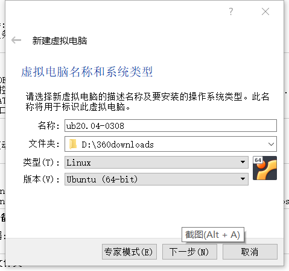
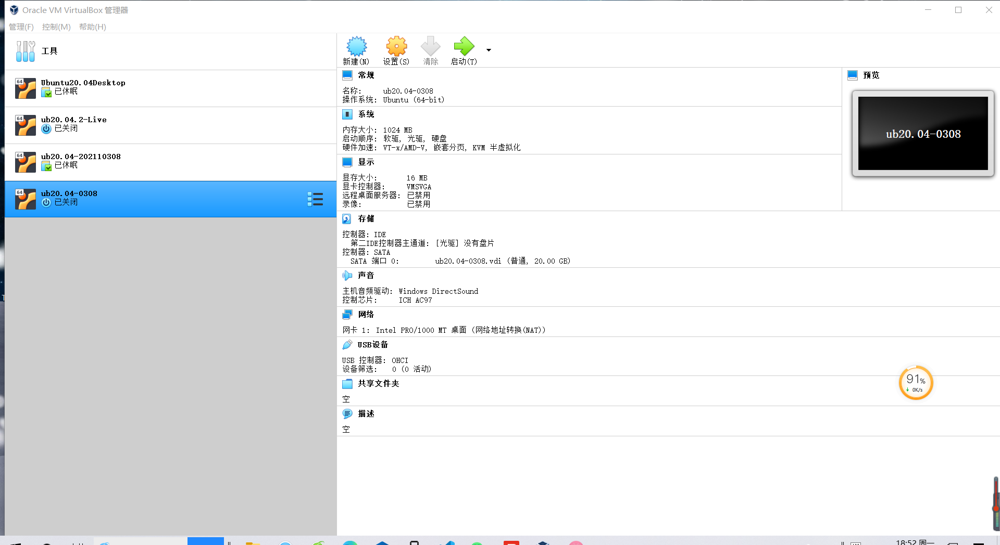
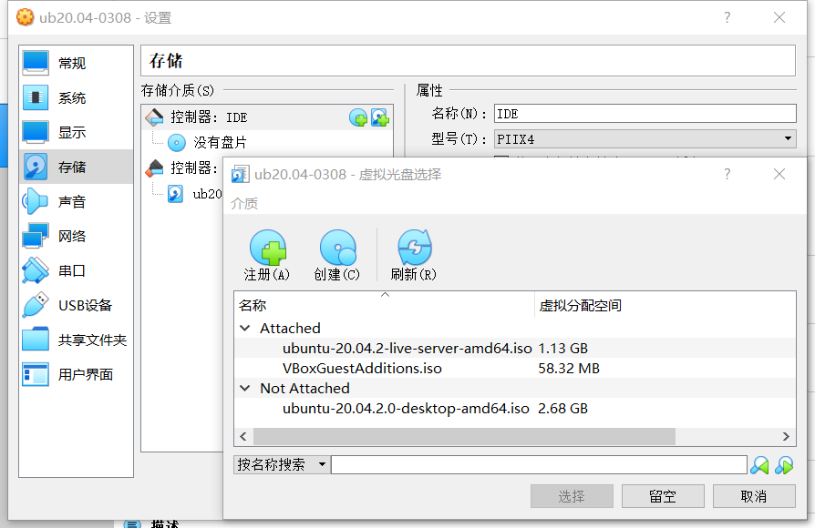
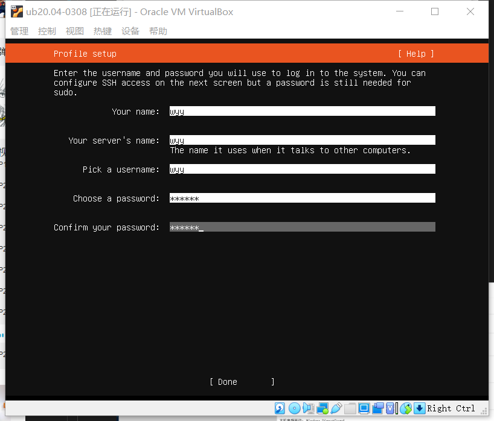
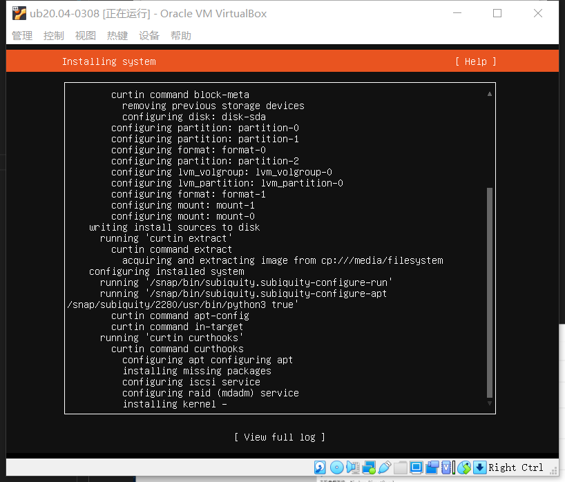
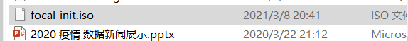
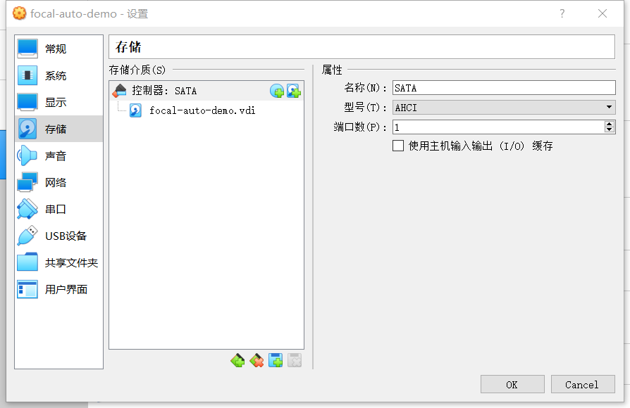
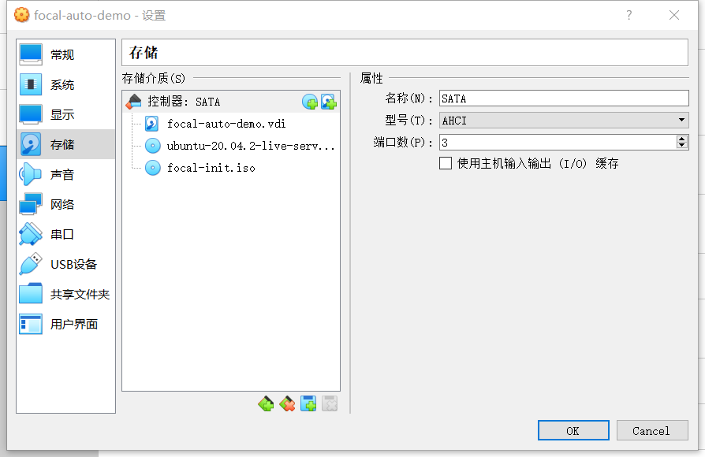
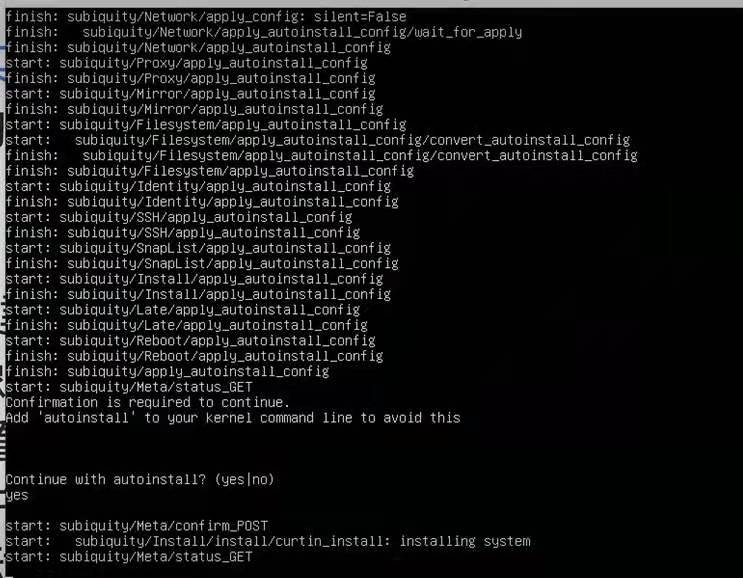
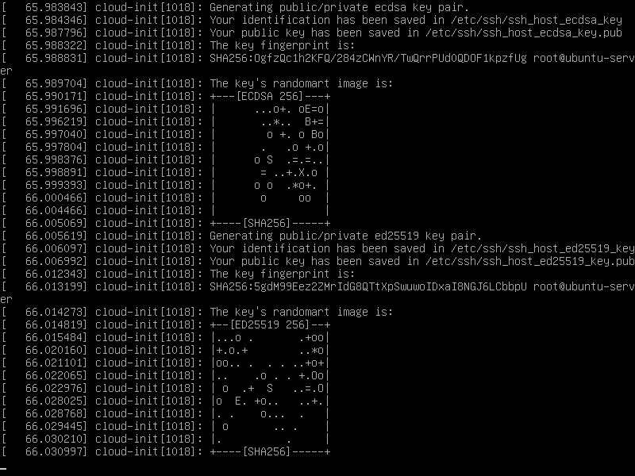

# first-one
这是第一次作业的实验报告

(1)先下载好正确的Ubuntu镜像文件。

(2)新建一个虚拟机Ub20.04-0308,之后再依次设置内存，创建虚拟硬盘，将动态分配内存尽可能设置大一点，一系列步骤之后，该虚拟机就创建好了。

（3）打开设置，提前设置好双网卡，即网络地址转换NAT与Host-Only网络。之后点击储存，找到安装好的虚拟镜像文件作为虚拟光盘添加进入虚拟机，切记不要选到了错误的镜像。之后我们便可以启动这个虚拟机了。注意：第一次启动的时候会提醒你选择相关的镜像，选择正确的镜像之后，点击start。

（4）进去之后会先进行光盘完整性的检查，之后就来到了安装介质选择，安装语言选择English,之后依次点击done,之后设置用户名与密码，之后在Install OpenSSH server前面按空格选中，之后依次点击done，就可以开始安装了。

（5）手动安装好Ubuntu之后得到一个自动配置文件：/var/log/installer/autoinstall-user-data，对照 Ubuntu 20.04 + Autoinstall + VirtualBox 中提供的示例配置文件进行修改，之后制作包含user-data和meta-data的ISO镜像文件，假设命名为 focal-init.iso。

（6）之后新建一个名为focal-auto-demo的虚拟机，找到这个新建好的无人值守的虚拟机，点击设置，点击储存来移除掉控制器，之后在「控制器：SATA」下新建 2 个虚拟光盘，按顺序先挂载纯净版Ubuntu安装镜像文件，后挂载focal-init.iso。

（7）启动虚拟机，稍等片刻会看到命令行中出现提示信息：Continue with autoinstall? (yes|no)。此时，需要输入yes并按下回车键，剩下的就交给「无人值守安装」程序自动完成系统安装和重启进入系统可用状态了。

